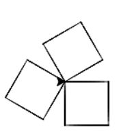

5.2. Корњача графика - понављање, гранање, угнежђене петље, процедуре, торке/листе
##################################################################################

У програмима које задајемо корњачи често су облици правилни и неке се
наредбе понављају. Стога у програмима можемо користити и
петље. 

Квадрат - петља
'''''''''''''''
.. level:: 1
	   
.. questionnote::

   Исправи наредни програм тако да корњача црта квадрат чија је
   страница дугачка 100 корака.

Програм који исцртава квадрат можемо да скратимо ако уведемо наредбу
којом постижемо да се неки задати низ наредби више пута понови. 
У језику Python најлакши начин да се то уради је
наредба ``for``.  Као што смо већ видели, наредбу *ponovi n puta*
можемо записати као ``for i in range(n):``. Подсетимо се, не смемо да
заборавимо двотачку, а наредбе које се понављају наводимо увучене
неколико размака у односу на положај наредбе ``for``.
   
.. activecode:: корњача_квадрат_петља
   :nocodelens:

   import turtle
   for i in range(0):        # ponovi 4 puta:
       turtle.forward(0)     #   idi napred 100 koraka
       turtle.left(0)        #   okreni se nalevo za 90 stepeni

Погледај наредни видео:

.. ytpopup:: d1vAfYFq-l8
    :width: 735
    :height: 415
    :align: center

Провери своје разумевање петљи и кретања корњаче тако што ћеш поређати наредбе програма
у ком корњача исцртава једнакостранични троугао чија је дужина странице 120 пиксела и коме су странице црвене боје. Приликом писања програма, постављање боје ставити ван петље, а у петљи прво
описати исцртавање странице, па након тога навести одговарајући угао за колико треба окренути врх који оставља траг.

.. parsonsprob:: троугао_ређање

   Поређај делове кода тако да представљају исправно решење овог задатка.
   -----
   import turtle
   =====
   turtle.color("red")
   =====
   for i in range(3):
   =====
      turtle.forward(100)
   =====
      turtle.left(120)

       
Испрекидана линија
''''''''''''''''''
.. level:: 1

.. questionnote::

   У једном од претходних задатака нацртали смо испрекидану линију
   тако што смо много пута понављали исте наредбе. Скрати претходни
   програм коришћењем петље тако што ћеш нацртати испрекидану линију
   која се састоји од пет делова.

.. activecode:: испрекидана_линија
   :nocodelens:
   :enablecopy:
   :playtask:

   import turtle
   for i in range(5):
                                  # idi napred 20 koraka
                                  # podigni olovku
                                  # idi napred 20 koraka
                                  # spusti olovku
   ====
   import turtle
   for i in range(5):
       turtle.forward(20)           # idi napred 20 koraka
       turtle.penup()               # podigni olovku
       turtle.forward(20)           # idi napred 20 koraka
       turtle.pendown()             # spusti olovku

Погледај наредни видео:

.. ytpopup:: JeoAB84nG7w
    :width: 735
    :height: 415
    :align: center

Отисци корњаче
''''''''''''''
.. level:: 1

.. questionnote::
   
   Напиши програм који коришћењем понављања исцртава 5 отисака корњаче
   размакнутих по 30 пиксела. Напиши програм без коришћења петље, а
   затим га скрати коришћењем петље.

.. activecode:: пет_отисака_корњаче
   :nocodelens:
   :enablecopy:
   :playtask:

   import turtle
   ====
   import turtle
   turtle.penup()
   turtle.shape("turtle")
   for i in range(5):
       turtle.stamp()
       turtle.forward(30)

       

Гранање
-------

Приликом цртања неких фигура корњача наизменично треба да извршава
одређене врсте наредби. На пример, приликом цртања испрекидане линије
корњача у сваком кораку помера напред и након сваког померања или
подиже или спушта оловку и то чини наизменично (напред, подигни,
напред, спусти, напред, подигни, напред, спусти). То је могуће постићи
тако што се у сваком кораку петље испитује да ли је вредност бројача
парна или непарна тј. да ли бројач при дељењу са два даје остатак 0 (као што
ћемо детаљније описати у поглављу о `израчунавању
<../Izracunavanje/toctree.html>`_, у језику Python се остатак при
дељењу броја ``i`` са 2 може израчунати помоћу ``i % 2``). Гранање,
тј. условно извршавање наредби, постижемо помоћу наредбе ``if-else``.

Испрекидана линија
''''''''''''''''''
.. level:: 2

.. questionnote::	   

   Нацртај поново испрекидану линију, али овај пут коришћењем гранања.

Корњача иде напред 10 пута, при чему пет пута од тога има подигнуту, а
пет пута има спуштену оловку. Дакле, уведи петљу чије се тело понавља
десет пута, у телу петље помери корњачу за 20 корака, а затим или
подигни или спусти оловку, тако да то буде наизменично (то можеш
реализовати тако што ћеш у парним корацима подизати, а у непарним
корацима спуштати оловку). Имајући ово у виду, исправи наредни програм
тако да црта испрекидану линију.

.. activecode:: испрекидана_линија_1
   :nocodelens:
   :enablecopy:
   :playtask:

   import turtle
   for i in range(0):
       turtle.forward(0)
       if True:
           turtle.penup()
       else:
           turtle.pendown()
   ====
   import turtle
   for i in range(10):
       turtle.forward(20)
       if i % 2 == 0:
           turtle.penup()
       else:
           turtle.pendown()   

Погледај наредни видео:

.. ytpopup:: 8N1mQD16w74
    :width: 735
    :height: 415
    :align: center
  
Звезда без пресецања
''''''''''''''''''''
.. level:: 2

.. questionnote::

   Напиши програм у којем корњача црта звезду без цртања унутрашњег
   петогула, као на следећој слици.

   .. image:: ../../_images/kornjaca-zvezda.png
      :align: center

Звезду можемо нацртати тако што нацртамо десет дужи (десет кракова
једнакокраких троуглова који представљају краке звезде). Након цртања
сваке од тих дужи окрећемо се и то наизменично налево за
:math:`72^\circ` (када смо у дну крака) па надесно за
:math:`144^\circ` (када смо на врху крака). Поново наизменично
изршавање наредби (овај пут окретања) можемо остварити тако што
проверавамо парност бројачке променљиве.
     
.. activecode:: корњача_петокрака_1
   :nocodelens:
   :enablecopy:

   import turtle
   for i in range(10):        # ponovi 10 puta:
       turtle.forward(40)     #    idi napred 40 koraka
       if ???:                #    ako je vrednost brojaca i paran broj:
           turtle.???         #       okrneni se ulevo za 72 stepena
       else:                  #    u suprotnom:
           turtle.???         #       okreni se udesno za 144 stepena

Угнежђене петље
---------------

У сложенијим задацима имамо потребу да се облици који се ицртавају
коришћењем петљи понављају неколико пута. Тако се добијају програми
који садрже петље у чијем телу се налазе друге петље. Такве петље
називају се **угнежђене петље**. Урадимо неколико примера овог облика.

Обратите пажњу на вредности које промењљива ``i`` узима током извршавања петље.
Током извршавања петље облика ``for i in range(n):`` променљива ``i``
редом узима вредности ``0``, ``1``, ``2`` итд., све до вредности
``n-1``. На пример, ако је ``n`` једнако ``3``, тада ће се тело петље
извршити пет пута и у првом извршавању тела петље променљива ``i`` ће
имати вредност ``0``, у другом вредност ``1``, а у трећем вредност
``2``.

Три квадрата
''''''''''''
.. level:: 2
	   
.. questionnote::

   Напиши програм којим корњача црта мало сложенији облик који се
   састоји од три квадрата, ротираних за по 120 степени један у односу
   на други, као на слици.

.. activecode:: полигони_угнежђена_петља
   :nocodelens:
   :enablecopy:

   import turtle

   for i in range(3):
       for j in range(4):
           turtle.forward(50)
	   turtle.right(90)
       turtle.right(120)

По сличном принципу можемо нацртати и доста сложеније облике.

Компликованија звезда
'''''''''''''''''''''
.. level:: 3

.. questionnote::

   Напиши програм у којем корњача црта звездицу приказану на слици.
   Она се састоји од 20 троуглова чија је страница дугачка 60 корака,
   који су распоређени око правилног двадесетоугла чија је дужина
   странице 10 корака.

   .. image:: ../../_images/kornjaca-komplikovana-zvezda.png
      :align: center

Исправи наредни програм тако да се добије облик са слике.
	      
.. activecode:: полигони_угнежђена_петља_1
   :nocodelens:
   :enablecopy:
   :playtask:

   import turtle
   m = 20
   n = 3
   turtle.speed(0)
   for i in range(0):
       turtle.color("red")
       for j in range(0):
           turtle.forward(0)
           turtle.left(0)
       turtle.color("black")
       turtle.forward(0)
       turtle.left(0)
   ====
   import turtle
   m = 20
   n = 3
   turtle.speed(0)
   for i in range(m):
       turtle.color("red")
       for j in range(n):
           turtle.forward(60)
	   turtle.left(360/n)
       turtle.color("black")
       turtle.forward(10)
       turtle.left(360/m)
         

.. questionnote::

   Напиши програм који исцртава десет квадрата који имају заједничко
   доње лево теме и чије су дужине страница редом 10, 20, 30, 40 и
   тако даље.

.. activecode:: квадрати
   :nocodelens:
   :enablecopy:
   :playtask:

   import turtle
   n = 10
   for i in range(10):
       a = 10*i + 10
       ???
   ====
   import turtle
   n = 10
   for i in range(10):
       a = 10*i + 10
       for i in range(4):
           turtle.forward(a)
           turtle.left(90)
       

