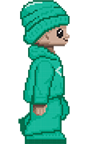

26.1. Анимације задаци
======================

На прошлом часу прошли смо кроз општи принцип по ком ћемо програмирати анимације. Провежбај
ово кроз наредних неколико задатака.

Насумично цртање кругова
''''''''''''''''''''''''

.. questionnote::

   Напиши програм који четири пута у секунди мења положај и боју круга
   који се приказује на прозору. Положај и боју одређивати насумично,
   тако да се круг у сваком тренутку налази унутар прозора.

Приступимо решавању овог задатка на начин који смо описали. Размисли
прво који подаци описују стање наше анимације.

.. mchoice:: pygame_quiz_animacija_1_promenljive
   :multiple_answers:
   :answer_a: Координата x центра лоптице.
   :answer_b: Брзина лоптице.
   :answer_c: Координата y центра лоптице.
   :answer_d: Боја лоптице.
   :answer_e: Број лоптица у прозору.
   :correct: a, c, d
   :feedback_a: Тачно.
   :feedback_b: Покушај поново.
   :feedback_c: Тачно.
   :feedback_d: Тачно.
   :feedback_e: Покушај поново.

   Које променљиве одређују стање анимације?
                
- Дакле, тренутно стање сцене одређено је координатама центра ``x``
  и ``y``, полупречником ``r`` и бојом круга ``boja`` и њих ћемо
  представити глобалним променљивама (при чему се полупречник неће
  мењати).

Размисли сада шта је задатак функције ``crtaj``.

.. mchoice:: pygame_quiz_animacija_1_crtaj
   :multiple_answers:
   :answer_a: Да насумично одреди положај лоптице тако што ће одредити
              вредности променљивих ``x`` и ``y``.
   :answer_b: Да пре цртања обоји позадину у бело, да би се обрисао
              претходни цртеж.
   :answer_c: Да нацрта круг са центром у тачки одређеној координатама
              ``x`` и ``y``.
   :answer_d: Да обоји позадину прозора у боју ``boja``.
   :answer_e: Да помери лоптицу један пиксел удесно увећавајући
              вредност променљиве ``x``.
   :correct: b, c
   :feedback_a: Покушај поново.
   :feedback_b: Тачно.
   :feedback_c: Тачно.
   :feedback_d: Покушај поново.
   :feedback_e: Покушај поново.

   Шта функција ``crtaj`` треба да уради?
                
- Дакле, функција ``crtaj`` ће бојити позадину у бело (како би се
  обрисао претходни круг) и цртаће круг на основу тренутних вредности
  глобалних променљивих.

Размисли сада шта је задатак функције ``novi_frejm``.

.. mchoice:: pygame_quiz_animacija_2_crtaj
   :multiple_answers:
   :answer_a: Да помери лоптицу један пиксел удесно увећавајући
              вредност променљиве ``x``.
   :answer_b: Да увећа полупречник лоптице ``r`` за 1.
   :answer_c: Да нацрта круг са центром у тачки одређеној координатама
              ``x`` и ``y``.
   :answer_d: Да на насумичан начин одреди нову вредност променљиве
              ``boja``.
   :answer_e: Да насумично одреди положај лоптице тако што ће одредити
              вредности променљивих ``x`` и ``y``.
   :correct: d, e
   :feedback_a: Покушај поново.
   :feedback_b: Покушај поново.
   :feedback_c: Покушај поново.
   :feedback_d: Tачно.
   :feedback_e: Тачно.

   Шта функција ``novi_frejm`` треба да уради?
  
- Дакле, функција ``novi_frejm`` ће насумично одредити боју новог
  круга и одредиће x и y координате центра, тако да круг не испадне
  ван екрана. То ће важити ако x координата буде у интервалу
  :math:`[r, sirina-r]`, а y координата буде у интервалу :math:`[r,
  visina-r]`.
  
Покушај да самостално напишеш цео програм. Ако не успеш, не брини, јер
тек почињеш да учиш како се реализују апликације. Потражи помоћ и
затим допуни започети програмски кôд.

.. activecode:: nasumicni_krugovi
   :nocodelens:
   :modaloutput: 
   :enablecopy:
   :playtask:
   :help:
   :includexsrc: _includes/nasumicni_krugovi.py

   # funkcija koja vraća nasumično određenu boju
   def nasumicna_boja():
       return (random.randint(0, 255), random.randint(0, 255), random.randint(0, 255))
    
   r = 20                               # poluprečnik kruga
   (x, y) = (sirina // 2, ???)          # u prvom trenutku je krug na centru prozora
   boja = nasumicna_boja()              # boju određujemo na nasumičan način
    
   def crtaj():
       prozor.fill(pg.Color("white"))                 # bojimo pozadinu u belo
       pg.draw.circle(prozor, ???, (???, ???), ???)  # crtamo krug
    
   def novi_frejm():
       global x, y, boja  # promenljive koje se menjaju
       # određujemo centar tako da krug ne ispadne van ekrana
       (x, y) = (random.randint(r, ???), random.randint(???, visina - r))
       ??? = nasumicna_boja()  # boju određujemo na nasumičan način

Срце које куца
''''''''''''''

.. questionnote::

   Напиши програм који приказује анимацију срца које куца. Срце можеш
   приказати коришћењем слике ``srce.png``.

.. image:: ../../_images/srce.png
   :width: 150px
           

- Једини податак који се мења од фрејма до фрејма је то да ли треба
  или не треба приказати срце. Можемо увести логичку променљиву
  ``treba_crtati``.
- У функцији ``crtaj`` слику ћемо приказивати само ако променљива
  ``treba_crtati`` има вредност тачно (тј. ``True``).
- У функцији ``novi_frejm`` мењаћемо вредност променљиве
  ``treba_crtati``. Ако јој је тренутно вредност ``True``, тада треба
  да се промени на ``False``, а ако јој је тренутно вредност
  ``False``, тада треба да се промени на ``True``. Најлакши начин да
  се то уради је да текућу вредност негирамо помоћу оператора ``not``
  (наравно, можемо употребити и гранање).

Покушај да на основу овога допуниш започети програмски кôд.
           
.. activecode:: srce_slika
   :nocodelens:
   :modaloutput: 
   :enablecopy:
   :playtask:
   :includexsrc: _includes/srce_blinka_slika.py

   srce_slika = pg.image.load("srce.png")  # slika srca
   treba_crtati = True  # da li treba crtati srce

   def crtaj():
       prozor.fill(pg.Color("white"))   # bojimo pozadinu u belo
       if ???:                          # crtamo srce ako je to potrebno
           prozor.blit(???, (0, 0))

   def novi_frejm():
       global treba_crtati
       treba_crtati = ???      # negiramo vrednost treba_crtati
       crtaj()

      
Смајлић и тужић
'''''''''''''''

.. questionnote::

   Микица често мења расположење. Час је срећна, час је тужна. Напиши
   програм који приказује слике смајлића и тужића које се наизменично
   смењују. Можеш употребити слике ``smajlic.png`` и ``tuzic.png``.

.. image:: ../../_images/smajlic.png
   :width: 150px

Овај задатак је поново веома сличан претходном.

- Логичка променљива ``smajlic`` ће одређивати стање програма.
- Ако је у функцији ``crtaj`` вредност те променљиве ``True``,
  приказаћемо слику смајлића, а ако је вредност ``False``, приказаћемо
  слику тужића.
- У функцији ``novi_frejm`` негираћемо вредност променљиве
  ``smajlic``.

Покушај да на основу овога потпуно самостално напишеш програм. Ако не
успеш, онда потражи помоћ и допуни започети програмски кôд.
           
.. activecode:: smajlic_tuzic
   :nocodelens:
   :modaloutput: 
   :enablecopy:
   :playtask:
   :help:
   :includexsrc: _includes/smajlic_tuzic.py

   smajlic_slika = pg.image.load("smajlic.png")
   tuzic_slika = ???

   smajlic = True  # da li treba crtati smajlića ili tužića

   def crtaj():
       prozor.fill(pg.Color("skyblue"))
       if smajlic:
           prozor.blit(smajlic_slika, ???)
       else:
           prozor.blit(???, (0, 0))

   def novi_frejm():
       global smajlic
       # smajlic = not smajlic - uradi promenu promenljive pomoću grananja
       if ???:
           smajlic = ???
       else:
           smajlic = ???
       crtaj()

Сијалице
''''''''

.. questionnote::

   Напиши програм који приказује дисплеј на коме је поређано 10
   сијалица, тако да се наизменично укључује једна по једна.

- Стање програма ће у потпуности бити одређено вредношћу променљиве
  редним бројем сијалице која је укључена.
- У функцији ``crtaj`` исцртаваћемо само укључену сијалицу у облику
  белог круга. Пречник сваке сијалице ћемо одредити тако што ћемо
  ширину екрана поделити редним бројем сијалице. Координата x центра
  те сијалице биће одређена редним бројем укључене сијалице (центар
  сијалице 0 налази се на растојању ``r`` од леве ивице екрана, центар
  сијалице 1 на растојању ``r + 2r``, центар сијалице 2 на растојању
  ``r+4r`` и тако даље).
- У функцији ``novi_frejm`` увећаваћемо редни број укључене сијалице,
  при чему ћемо га враћати на нулу када достигне укупан број сијалица.

Покушај да на основу претходне дикусије потпуно самостално решиш
задатак. Ако не успеш, онда потражи помоћ, па допуни започети кôд.
  
.. activecode:: diode_jednostavno
   :nocodelens:
   :modaloutput: 
   :enablecopy:
   :playtask:
   :help:
   :includexsrc: _includes/diode_jednostavno.py

   broj_sijalica = 10                  # ukupan broj sijalica
   ukljucena = 0                       # redni broj trenutno uključene sijalice
   r = sirina // ???                   # poluprečnik jedne sijalice

   def crtaj():
       prozor.fill(pg.Color("black"))                         # bojimo pozadinu u crno
       (x, y) = (???, visina // 2)                            # izračunavamo položaj centra sijalice
       pg.draw.circle(prozor, pg.Color("white"), (x, y), r)   # crtamo sijalicu belom bojom

   def novi_frejm():
       global ukljucena
       ukljucena = ???                                        # prelazimo na narednu sijalicu
       crtaj()

       
Цртани филм
'''''''''''

.. questionnote::

   Напиши програм који приказује цртани филм тако што наизменично
   приказује пет слика на екрану на којима је приказан дечак који се
   шета у различитим положајима. Слике носе називе ``setanje1.png`` до
   ``setanje5.png``.

.. image:: ../../_images/setanje2.png

.. image:: ../../_images/setanje4.png

Овај задатак личи на задатак у ком смо током анимације циклично
мењали боје позадине, једино што ћемо уместо листе која садржи називе
боја чувати листу која садржи слике које чине цртани филм. Слике је
пожељно учитати на почетку програма, пре почетка анимације (подсетимо
се, слику можемо учитати помоћу функције
``pg.image.load``).

- Стање анимације биће одређено искључиво редним бројем слике која се
  тренутно приказује. Променљива ``slika`` представљаће позицију слике
  у листи која се приказује у текућем фрејму.
- Функција ``crtaj`` има задатак само да обрише екран (бојећи позадину
  у бело) и да затим прикаже слику из листе ``slike`` која се налази
  на позицији одређеној променљивом ``slika`` (подсетимо се, слику
  приказујемо помоћу функције ``prozor.blit``).
- Функција ``novi_frejm`` ће имати задатак да увећа вредност
  променљиве ``slika``, тако да се вредност врати на нулу када
  превазиђе последњу вредност у листи.

На основу претходне дискусије допуни наредни програм.

.. activecode:: crtani_film
   :nocodelens:
   :modaloutput: 
   :enablecopy:
   :playtask:
   :includexsrc: _includes/setanje_animacije.py

   # učitavamo u listu slike setanje1.png, setanje2.png, ..., setanje5.png
   slike = []   # niz u koji dodajemo slike
   for i in range(1, 6):
       naziv_slike = "setanje" + str(i) + ".png"  # gradimo naziv slike od delova
       slike.append(???)   # učitavamo sliku i dodajemo je na kraj niza

   slika = 0  # indeks tekuće slike

   def crtaj():
       prozor.fill(pg.Color("white"))    # bojimo pozadinu prozora u belo
       ???                               # prikazujemo sliku

   def novi_frejm():
       global slika  # ovu globalnu promenljivu menjamo
       slika = ???   # prelazimo na sledeću sliku
       crtaj()

       

