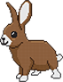

28.1. Анимације - сусрети објеката на екрану
============================================
У примерима који следе видећемо како да анимације програмирамо тако да се 
анимирани објекти сусрећу. Ако програме не бисмо писали на овај начин, наши објекти би пролазили једни 
кроз друге. На пример, да лик у некој игрици не би могао да пролази кроз зидове, морамо код написати тако 
да детектујемо тренутак када лик додирује зид и тако да му не дозволимо да настави да се креће у том правцу. 

Корњача и зец
'''''''''''''

.. questionnote::

   Напиши програм који приказује корњачу и зеца који полазе са два
   краја прозора, крећу се једно према другом (зец се креће два пута
   брже од корњаче) док се не сусретну, након чега се на екрану
   исписује порука ``Здраво``.

За разлику од претходних примера, у овом примеру вршимо анимацију два
различита објекта.

- Стање сцене је одређено положајем корњаче и положајем
  зеца. Променљивама ``kornjaca_x`` и ``kornjaca_y`` бележимо
  горњи леви угао слике корњаче (``kornjaca_slika``), а променљивама ``zec_x`` и ``zec_y``
  бележимо горњи леви угао слике зеца (``zec_slika``).

- Цртање и померање ће зависити од тога да ли су се корњача и зец
  срели. Корњача креће са левог, а зец са десног краја прозора.
  Тренутак сусрета је када десни крај слике 
  корњаче (на ``kornjaca_x`` додајемо ширину слике корњаче) достигне леви крај слике
  зеца.

- У функцији ``crtaj`` цртамо небо, земљу и сунце, чиме суштински бришемо
  претходни цртеж. Након тога приказујемо слике корњаче и зеца на
  положајима одређеним текућим стањем сцене. На крају проверавамо
  да ли су се корњача и зец срели и ако јесу, тада на средини прозора
  приказујемо ``Здраво``.

- У функцији ``novi_frejm`` прво проверавамо да ли су се зец и корњача
  срели. Ако јесу, анимација је завршена и не вршимо никакве
  промене. У супротном померамо корњачу на десно (увећавајући вредност ``kornjaca_x``) 
  и зеца на лево (умањујући вредност ``zec_x``). Зец
  треба да се креће брже па умањење треба да буде веће него
  увећање.

Допуни наредни програм на основу претходне дискусије.
  
.. activecode:: kornjaca_i_zec
   :nocodelens:
   :modaloutput: 
   :enablecopy:
   :playtask:
   :includexsrc: _includes/kornjaca_i_zec.py

   kornjaca_slika = pg.image.load("kornjaca.png")   # slika kornjače
   (kornjaca_x, kornjaca_y) = (???, ???)            # pozicija njenog gornjeg levog ugla
   zec_slika = pg.image.load("zec.png")             # slika zeca
   (zec_x, zec_y) = (???, ???)                      # pozicija njenog gornjeg levog ugla
    
   # funkcija koja ispisuje tekst tako da mu je centar na datoj poziciji
   def centriraj_tekst(tekst, x, y):
       font = pg.font.SysFont("Arial", 40)                   # font kojim se ispisuje tekst
       tekst = font.render(tekst, True, pg.Color("white"))   # sličica koja sadrži ispisan tekst
       (sirina_teksta, visina_teksta) = (???, ???)           # dimenzije te sličice
       (x, y) = (x - ???, y - ???)                           # koordinate gornjeg levog ugla
       ???                                                   # prikazujemo tekst
    
   # funkcija koja proverava da li su se sreli
   def sreli_su_se():
       desni_kraj_kornjace = ???                     # desni kraj slike kornjače
       levi_kraj_zeca = ???                          # levi kraj slike zeca
       return desni_kraj_kornjace >= levi_kraj_zeca  # proveravamo da li su se mimiošli
    
   def crtaj():
       pg.draw.rect(prozor, pg.Color("skyblue"), (0, 0, sirina, visina / 2))            # crtamo nebo
       pg.draw.rect(prozor, pg.Color("forestgreen"), (0, visina / 2, sirina, visina))   # crtamo zemlju
       pg.draw.circle(prozor, pg.Color("yellow"), (80, 80), 60)                         # crtamo sunce
       prozor.blit(kornjaca_slika, (kornjaca_x, kornjaca_y))                            # prikazujemo sliku kornjače
       ???                                                                              # prikazujemo sliku zeca
       if sreli_su_se():                                                                # ako su se sreli
           centriraj_tekst(???, ???, visina / 3)                                        #   prikazujemo tekst
    
   def novi_frejm():
       global ???
       if not sreli_su_se():     # ako se nisu sreli
           kornjaca_x += 1       #    pomeramo kornjaču jedan piksel nadesno
           zec_x -= 2            #    pomeramo zeca dva piksela nalevo
       crtaj()
           
.. reveal:: kornjaca_i_zec_1
  :showtitle: Прикажи решење
  :hidetitle: Сакриј решење

  .. activecode:: kornjaca_i_zec_resenje
    :nocodelens:
    :includesrc: _includes/kornjaca_i_zec.py

Одбијање приликом сусрета
-------------------------

Стражар који патролира
''''''''''''''''''''''
   
.. questionnote::

   Напиши програм који приказује стражара који патролира лево десно по
   екрану. Користи дате слике ``strazar_levo.png`` и ``strazar_desno.png``

.. image:: ../../_images/strazar_levo.png
.. image:: ../../_images/strazar_desno.png

- Стање сцене садржи текућу позицију стражара. Позиција
  може, на пример, бити одређена променљивом ``x`` која региструје x
  координату горњег левог угла слике стражара
  (иницијализује се на нулу и током анимације се мења) и
  променљивом ``y`` која се иницијално поставља тако да се стражар
  налази на поду (вредност је једнака разлици висине
  прозора и висине слике стражара) и која не мења своју вредност. 
  Када стражар дође до краја прозора мења му се смер кретања. 
  Зато ће стање сцене бити одређено и његовим смером кретања. Смер
  може бити представљен знаком променљиве која представља брзину
  кретања. Претпоставићемо да брзину кретања одређује променљива
  ``dx``, која може бити и позитивна и негативна.

- У функцији ``novi_frejm`` координату  :math:`x` увећавамо за ``dx``. Ако
  је ``dx`` позитиван број, тада :math:`x` координата расте и
  стражар ће се кретати на десно. Ако је ``dx`` негативан број, тада
  :math:`x` координата опада и стражар ће се кретати на лево. Када
  стражар испадне ван прозора (када му је координата :math:`x` десног краја
  већа од ширине прозора или му је координата :math:`x` левог краја мања од
  нуле, тј. када је ``x < 0`` или је ``x + strazar_sirina > sirina``),
  тада му се смер кретања мења тако што се промени знак брзине ``dx``.

- У функцији ``crtaj`` приказујемо слику стражара тако да јој горње
  лево теме буде у тачки ``(x, y)``. Пошто знак броја ``dx`` одређује
  и смер кретања, на основу њега одређујемо слику коју ћемо
  приказивати (када је вредност позитивна приказујемо слику стражара
  окренутог надесно, а када је негативна приказујемо слику стражара
  окренутог налево).

На основу претходне дискусије допуни наредни програм.
	   
.. activecode:: strazar_patrolira
   :nocodelens:
   :modaloutput: 
   :enablecopy:
   :playtask:
   :help:
   :includexsrc: _includes/strazar_patrolira.py

   # učitavamo dve slike -
   # stražara okrenutog na levo i stražara okrenutog na desno
   strazar_levo  = pg.image.load('strazar_levo.png')
   strazar_desno = ???
    
   # izračunavamo dimenzije slika (obe slike su istih dimenzija)
   strazar_sirina = strazar_levo.get_width()
   strazar_visina = ???
    
   # početni polozaj stražara (gornjeg levog ugla slike)
   x = 0
   y = ???
   # horizontalni pomeraj stražara u pikselima u svakom koraku
   dx = 2
    
   def crtaj():
       prozor.fill(pg.Color("white"))    # bojimo pozadinu u belo
       # u zavisnosti od smera kretanja biramo sliku koja će se prikazivati
       if dx > 0:
           slika = strazar_desno
       else:
           slika = ???
       prozor.blit(slika, ???)      # prikazujemo sliku na prozoru
       
    
   def novi_frejm():
       global x, dx  # globalne promenljive koje se mogu promeniti
       ???           # pomeramo stražara
       if x < 0 or x + strazar_sirina > sirina: # ako je stražar ispao van prozora
           ???  # menjamo mu smer kretanja
       crtaj()

Авион
'''''

.. questionnote::

   Напиши програм који приказује авион који полеће (из доњег левог
   угла прозора), пење се крећући се надесно док не додирне врх прозора,
   затим се спушта и даље крећући се надесно док не додирне земљу и
   онда наставља да се креће по земљи док изађе ван прозора на његовом
   десном делу. Можеш употребити слику ``avion.png``, а на небо можеш
   поставити слику ``sunce.png``.

.. image:: ../../_images/avion.png
.. image:: ../../_images/sunce.png

- Положај авиона можемо регистровати променљивама ``avion_x`` и ``avion_y`` које
  представљају координате горњег левог угла слике авиона. Пошто се
  током кретања авиона мења његов смер кретања, потребно је да део
  стања буде и правац, смер и брзина кретања.
  Све ове информације могу бити представљене помоћу променљивих
  ``avion_dx`` и ``avion_dy``. Број ``avion_dx`` ће представљати
  хоризонталну брзину авиона (за колико ће се пиксела
  мењати :math:`x` координата авиона приликом преласка на наредни
  фрејм). Пошто се авион стално помера на десно и то увек истом
  брзином, ова променљива ће имати сталну позитивну вредност. 
  Број ``avion_dy`` ће
  представљати вертикалану брзину авиона (за колико ће се
  пиксела мењати ``avion_y`` координата авиона приликом преласка на наредни фрејм). Када је негативна,
  :math:`y` координата опада и авион ће се подизати (мање y координате су ближе врху прозора). 
  Када је једнака 0 авион неће мењати висину, а када је
  позитивна :math:`y` координата расте и авион ће се спуштати.
- Функција ``crtaj`` боји прозор у небо-плаву боју (чиме се пребрише претходни фрејм),
  прикаже слику сунца (на жељеној позицији) и слику
  авиона (на позицији одређеној променљивама ``avion_x`` и
  ``avion_y``).
- Функција ``novi_frejm`` ажурира ``avion_x``
  и ``avion_y`` тако што их увећа за вредности брзина ``avion_dx`` и
  ``avion_dy``. Приметимо да се авион хоризонтално
  увек креће надесно, тако да је потребно мењати само вертикални смер. 
  Иницијално авион треба да се подиже
  тако да ће иницијална вертикална брзина ``avion_dy`` бити постављена
  на негативну вредност (нпр. на -1).  Када врх авиона достигне врх
  прозора, тада авион треба да почне да се спушта, тако да ћемо му
  вертикалну брзину ``avion_dy`` поставити на позитивну вредност
  (нпр. на 1). На крају, када дно слике авиона (које можемо израчунати
  тако што положај врха слике авиона увећамо за висину те слике)
  достигне дно прозора, тада авион треба да се креће по земљи, што
  значи да вертикални померај ``avion_dy`` треба да постане 0.
           
.. activecode:: avion
   :nocodelens:
   :modaloutput: 
   :enablecopy:
   :playtask:
   :help:
   :includexsrc: _includes/avion.py

   sunce_slika = pg.image.load("sunce.png")   # slika sunca
   avion_slika = ???                          # slika aviona
   avion_visina = avion_slika.???             # visina slike aviona
    
   (avion_x, avion_y) = (???, ???)            # položaj aviona
   avion_dy = -1                              # vertikalna brzina - avion se prvo diže
    
   def crtaj():
       prozor.fill(pg.Color(???))             # bojimo pozadinu u nebo-plavu boju
       prozor.blit(???, (avion_x, avion_y))   # crtamo avion
       prozor.blit(???, (0, 0))               # crtamo sunce
    
   def novi_frejm():
       global avion_x, avion_y, avion_dy      # menjamo položaj i smer kretanja aviona
       ???                                    # pomeramo avion na desno
       ???                                    # menjamo mu visinu
       if ???:                                # ako je dodirnuo vrh ekrana
           avion_dy = 1                       # menjamo mu smer tako da počne da se spušta
       if ???:                                # ako je dodirnuo dno ekrana
           avion_dy = 0                       # prestaje da menja visinu
       crtaj()

   
Oдбијање лоптице
''''''''''''''''

.. questionnote::

   Напиши програм који приказује лоптицу која се креће и одбија о
   ивице прозора.

- У  променљивама ``x`` и ``y`` ћемо памтити координате центра лоптице 
  (на почетку лотпица се може налазити у центру прозора). Полупречник лоптице ћемо представити
  променљивом ``r``.

- Кретање лоптице се остварује тако што јој се у правилним временским 
  интервалима (на пример, на сваких 25 милисекунди) мењају ``x`` и ``y`` 
  координате (увећаватју или умањују за по 5 пиксела).
  Пошто су промене по обе координате идентичне, лоптица ће се
  увек кретати под углом од 45 степени у односу на ивице
  прозора. Промену координате ``x`` ћемо представити променљивом ``dx``
  која ће имати вредност или 5 или -5, у зависности од тога да ли се
  лоптица креће надесно или налево. Слично ћемо употребљавати и
  променљиву ``dy`` за кретање на горе и на доле. Уређени пар ``(dx, dy)`` представља вектор
  брзине кретања лоптице. Помераћемо лоптицу тако што ``x`` увећамо за
  ``dx``, а ``y`` за ``dy``.

- Након сваког померања провераваћемо да ли је лоптица излетела ван
  граница прозора. Хоризонталну проверу можемо извршити тако што ћемо
  проверити да ли је леви крај лоптице лево од леве ивице прозора, или је
  десни крај лоптице десно од десне ивице прозора. Леви крај лоптице има
  :math:`x` координату једнаку ``x-r``, а десни крај има :math:`x` координату једнаку
  ``x+r``, па се провера своди на то да се провери да ли ``x-r < 0`` или
  је ``x+r > sirina``. Ако је то случај, тада се мења смер хоризонталног
  кретања тако што се промени знак вредности ``dx``. Потпуно аналогно се
  врши и вертикална провера (само се уместо ``x`` користи ``y``, уместо
  ``dx`` користи ``dy`` и уместо ``sirina`` користи ``visina``).

.. activecode:: loptica
   :nocodelens:
   :modaloutput: 
   :enablecopy:
   :playtask:
   :help:
   :includexsrc: _includes/loptica.py

   (x, y) = (sirina // 2, visina // 2) # pozicija loptice (na početku je u centru prozora)
   (dx, dy) = (2, 2)  # vektor brzine kretanja loptice
   r = 30             # poluprečnik loptice
    
   def crtaj():
       # crtamo lopticu
       prozor.fill(pg.Color("white"))
       ???
    
   def novi_frejm():
       global x, y, dx, dy  # ove promenljive se mogu menjati ovom funkcijom
       # pomeramo lopticu
       x += dx
       ???
       # ako je loptica ispala van prozora, menjamo joj smer
       if x - r < 0 or x + r > sirina:
           dx = -dx
       ???
       crtaj()
