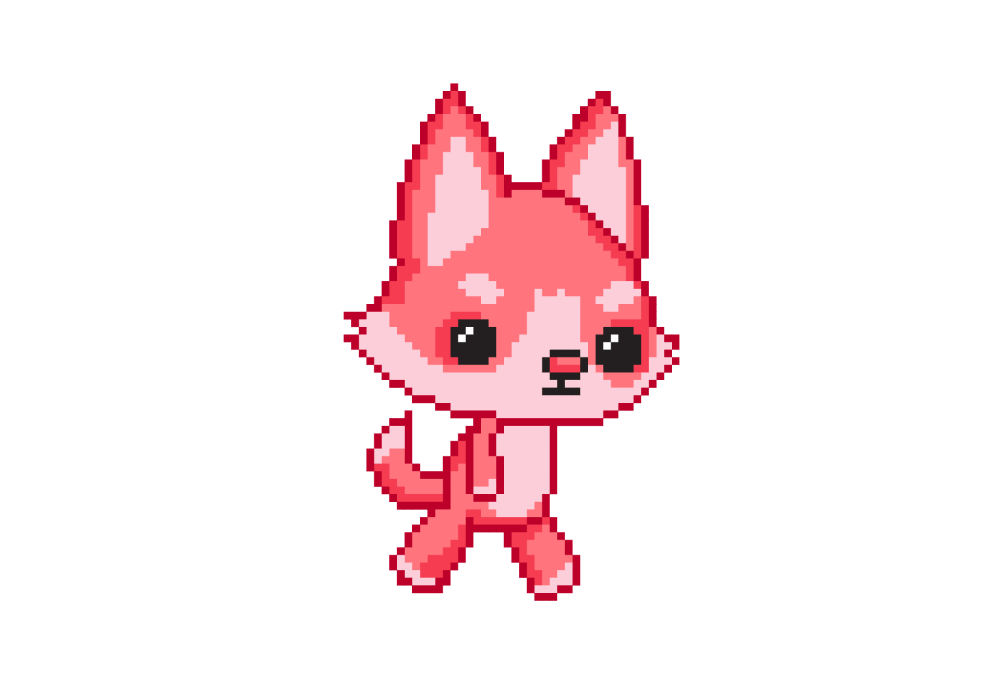

25.1. Анимације
===============

Вероватно већ знаш да цртани тј. анимирани филм настаје тако што се на екрану брзо
смењују сличице, при чему је свака следећа слика веома слична
претходној (ликови на слици су само мало померени у односу на
претходни положај).

.. learnmorenote::
   Од почетка производње цртаног филма, цртачи слика које ће брзим смењивањем чинити цртани филм,
   цртали су их на папиру.
   Данас се сличице цртају на рачунару, обично тако што цртачи цртају такозване кључне слике
   а рачунар генерише мноштво међуслика које су међусобно сличне а налазе се између две кључне слике.

На пример, од наредних осам сличица лика у различитим положајима:

.. image:: ../../_images/liktrci1.png
   :width: 120px

.. image:: ../../_images/liktrci3.png
   :width: 120px
.. image:: ../../_images/liktrci4.png
   :width: 120px
.. image:: ../../_images/liktrci5.png
   :width: 120px
.. image:: ../../_images/liktrci6.png
   :width: 120px
.. image:: ../../_images/liktrci7.png
   :width: 120px
.. image:: ../../_images/liktrci8.png
   :width: 120px

настаје следећа анимација трчања:
           
.. image:: ../../_images/liktrci.gif
   :width: 120px

.. infonote::           
   Анимације подразумевају брзу промену слике на екрану (на пример, 20
   пута у секунди), у правилним временским интервалима (на пример,
   на сваких 50 милисекунди). Свака тако кратко приказана слика назива се
   *оквир* или *фрејм* анимације (енгл. *frame*).

У досадашњим примерима цртање смо вршили једном, **пре** главне петље програма
у којој смо чекали да корисник искључи прозор (нпр. пре позива функције
``pygamebg.wait_loop`` из библиотеке PyGameBg).

У програмима са анимацијом цртање ћемо вршити **унутар** тела
главне петље где се обично позива наша функције која нешто црта.
(нпр. унутар функције ``pygamebg.frame_loop`` из библиотеке PyGameBg).

Програмирање анимација на сајту "Петља"
---------------------------------------

Анимације које следе разликоваће се по
томе који подаци одређују оно што се на слици налази, коду који
извршава цртање и коду који мења податке када се прелази на наредни
фрејм. 

Цртање и прелазак са тренутног на наредни фрејм
ћемо издвојити у две помоћне функције које ти треба да напишеш. 

.. infonote::
   Главну петљу програма која те две функције позива ћемо ми писати у "сивом делу кода". 

Твој задатак ће бити и да дефинишеш променљиве које описују оно што се
налази на екрану током анимације. Обично су то координате објеката тј. ликова који се током
анимације померају, њихова брзина, али и неки други подаци који се
мењају током анимације.

Прикажимо кроз примере технику која олакшава прављење анимација. Засновани су на библиотеци 
PyGameBg па ће "сиви кôд" бити једноставан!

Посебна функција за цртање у програму без анимације
'''''''''''''''''''''''''''''''''''''''''''''''''''

Нацртајмо три концентрична круга у главном програму.

.. activecode:: tri_kruga
   :nocodelens:
   :modaloutput: 
   :enablecopy:
   :includesrc: _includes/tri_kruga.py

Дефинишимо сада функцију ``crtaj`` коју ћемо позвати из главног програма (пребацићемо
позив у сиви део кода).

.. activecode:: tri_kruga_funkcija
   :nocodelens:
   :modaloutput: 
   :enablecopy:
   :includesrc: _includes/tri_kruga_funkcija.py

Насумично одређивање боје позадине током анимације
''''''''''''''''''''''''''''''''''''''''''''''''''

Наредни програм приказује анимацију у којој насумично
смењујемо боју позадине. Дефинисана је функцију `crtaj` која
тражи боју а затим се позадина прозора боји том
бојом. Боју одређује посебна функција `nasumicna_boja`. Користимо библиотеку *PyGameBg* 
па анимацију покрећемо позивом `pygamebg.frame_loop(4, crtaj)`, 
што значи да се функција `crtaj` позива 4 пута у секунди.

.. activecode:: boja_pozadine_nasumicno_bez_stanja
   :nocodelens:
   :modaloutput: 
   :enablecopy:
   :includesrc: _includes/boje_pozadine_nasumicno_bez_stanja.py