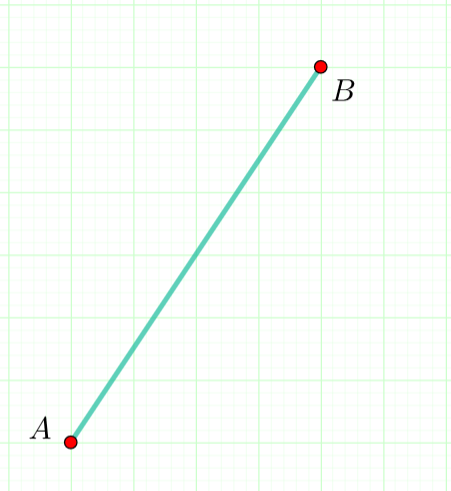

19.1. Дужи
==========

.. infonote::
   Све функције за цртање у библиотеци Pygame почињу са ``pg.draw``.

Дуж :math:`AB` се црта позивом функције ``pg.draw.line``. Позив ове функције у општем облику изгледа овако: 
``pg.draw.line(prozor, boja, (А_x, А_y), (B_x, B_y), debljina)``. 
Први параметар је прозор на коме желимо да нацртамо дуж (увек ћемо га називати баш ``prozor``). 
Други параметар је боја дужи а у прошлом делу си научио/научила како се наводи боја. 
Следе почетна и крајња тачка (:math:`A` и :math:`B`) чије координате треба да унесеш у облику 
уређених парова (прво иде координата :math:`x` , a затим координата :math:`y`). 
Последњи параметар је дебљина линије којом се исцртава дуж, задата у пикселима. 

Пример једног позивa функције изгледао би овако: 
   
``pg.draw.line(prozor, pg.Color("black"), (100, 100), (300, 300), 5)``

.. questionnote::
   Редослед аргумената наведених у позиву функције је важан! Провери да
   ли тај редослед знаш.

   1) координате почетне тачке

   2) дебљина линије

   3) прозор

   4) координате крајње тачке
   
   5) боја

   Сложи их према правилном редоследу

   (Наведи редне бројеве аргумената према редоследу којим се аргументи морају навести, на пример 12435)

.. fillintheblank:: redosled

   Одговор: |blank|

   - :^\s*35142\s*$: Тачно
     :x: Одговор није тачан.

           
Провежбајмо сада цртање дужи кроз неколико задатака. Ови задаци ће ти
помоћи да боље упознаш координатни систем који користимо за
позиционирање тачака на прозору.

Слово А
'''''''

.. questionnote::

   Напиши програм који помоћу три дужи исцртава слово A.

Циљ овог задатка је да утврдимо наше сналажење у координатном
систему. За цртање слова :math:`A` потребно је исцртати три дужи (леву
косу линију, десну косу линију и хоризонталну црту). Величина прозора
је :math:`200` x :math:`200` и о овоме би требало водити рачуна приликом
одређивања координата тачака које представљају темена дужи. Спајањем
одговарајућих тачака, формирају се дужи.

Приметимо да смо у решењу увели променљиву ``debljina`` да бисмо
дебљину све три линије могли да контролишемо само на једном месту.  Ова
променљива је постављена (иницијализована) на почетку на 10 (наредбом
доделе ``debljina = 10``) и променом вредности ове променљиве мења се
дебљина све три дужи које чине наше слово. И у наредним програмима
ћемо уводити помоћне променљиве које ће нам помоћи да лакше пишемо и
прилагођавамо наше програме.

  
.. image:: ../../_images/slovoA.png
   :width: 400px   
   :align: center 

На слици можеш видети координате тачака. Тачка :math:`A` је од координатног
почетка удаљена :math:`50` пиксела по оси :math:`x` и :math:`150` пиксела 
по оси :math:`y`, зато су координате тачке :math:`A` :math:`= (50, 150)`. На
исти начин се одређују координате осталих тачака.  
Упиши их у програм
уместо упитника, а затим покрени програм и провери да ли се добија
слово А (једну линију смо већ уцртали).

.. activecode:: slovoA
   :nocodelens:
   :modaloutput: 
   :playtask:
   :includexsrc: _includes/slovo_A.py

   # bojimo pozadinu prozora u sivo
   prozor.fill(pg.Color("gray"))
    
   # debljina linije
   debljina = 10
   # leva kosa linija
   pg.draw.line(prozor, pg.Color("white"), (50, 150), (100, 50), debljina)
   # desna kosa linija
   pg.draw.line(prozor, pg.Color("white"), ???, ???, debljina)
   # horizontalna linija po sredini
   pg.draw.line(prozor, pg.Color("white"), ???, ???, debljina)     

.. reveal:: slovoA_resenje
   :showtitle: Прикажи решење
   :hidetitle: Сакриј решење

   .. activecode:: slovoA_resenje_1
      :nocodelens:
      :includesrc: _includes/slovo_A.py

Плус
''''

.. questionnote::

   Напиши програм који исцртава симбол плус у центру прозора димензије
   200x200 пиксела. Симбол се састоји од једне хоризонталне и једне
   вертикалне дужи дужине 100 пиксела и дебљине 10 пиксела.

Централни корак у решењу задатка је да два пута примениш функцију за
цртање дужи и њеном применом исцрташ симбол плус. У решењу је већ
нацртана вертикална дуж, а твој задатак је да нацрташ хоризонталну дуж
дужине 100 пиксела, зато добро промисли где ћеш поставити почетну,
односно крајњу тачку дужи (овај пут немаш помоћ). Ширина и висина
прозора су 200 пиксела. Анализирај позив функције
``pg.draw.line(prozor, pg.Color("black"), (100, 50), (100, 150),
debljina)`` и мало га прилагоди. 

.. infonote::
   Видиш да је на месту аргумента за
   боју наведен позив функције ``pg.Color("black")`` који враћа црну
   боју. Координате темена вертикалне дужи су ``(100, 50)`` и ``(100,
   150)``. Код хоризонталне дужи :math:`y` координата треба да буде одређена тако
   да се дуж налази на средини прозора по висини, док се :math:`x` координата простире од
   четвртине, па до три четвртине ширине прозора.
   
.. activecode:: plus
   :nocodelens:
   :modaloutput: 
   :playtask:
   :includexsrc: _includes/simbol_plus.py
      
   # bojimo pozadinu u belo
   prozor.fill(pg.Color("white"))
   # debljina linija je 10 piksela
   debljina = 10
   # vertikalna crna linija dužine 100 piksela
   pg.draw.line(prozor, pg.Color("black"), (100, 50), (100, 150), debljina)
   # horizontalna crna linija dužine 100 piksela
   pg.draw.line(prozor, pg.Color("black"), (???, ???), (???, ???), debljina)
      
.. reveal:: plus_resenje
   :showtitle: Прикажи решење
   :hidetitle: Сакриј решење

   Потребно је да направиш позив ``pg.draw.line(prozor,
   pg.Color("black"), (50, 100), (150, 100), debljina)``.

   
.. topic:: Погледај видео:

   Погледај овај видео како би утврдио/утврдила све што о чему смо говорили у овој лекцији.

    .. ytpopup:: 1Wl6yt0dKhA
        :width: 735
        :height: 415
        :align: center 

Најважније из ове лекције
=========================

* Позив функције за цртање дужи у општем облику изгледа овако ``pg.draw.line(prozor, boja, (teme1_x, teme1_y), (teme2_x, teme2_y), debljina)``.
* Дебљина линије је последњи аргумент и он може бити изостављен.