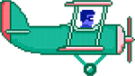

30.2. Анимације кретања домаћи
==============================

.. questionnote::

   Напиши програм који приказује анимацију авиона који се креће по
   небу и аутомобила који се креће по земљи, при чему је брзина авиона
   два пута већа него аутомобила. Када неко возило изађе на десном
   крају екрана, појављује се поново на левом. Поново можеш употребити
   слике ``auto.png`` и ``avion.png``.

Задатак веома једноставно можемо решити тако што практично два пута
поновимо кôд који смо написали у програму у ком смо вршили симулацију
кретања аутомобила. Понављање истог или сличног кода више пута је иначе веома
лоша пракса и касније ћемо видети начине да се то избегне када се ради
са више објеката, али с обзиром на то да се овде кôд понавља само
једном, то можемо толерисати.

.. activecode:: auto_avion
   :nocodelens:
   :modaloutput: 
   :enablecopy:
   :playtask:
   :includexsrc: _includes/auto_avion.py

   avion_slika = pg.image.load("avion.png")
   (avion_x, avion_y) = (0, ???)
   auto_slika = pg.image.load("auto.png")
   (auto_x, auto_y) = (0, ???)
    
   def crtaj():
       prozor.fill(pg.Color("white"))
       prozor.blit(avion_slika, (avion_x, avion_y)) # crtamo avion
       ???                                          # crtamo auto
    
   def novi_frejm():
       global avion_x, avion_y, auto_x, auto_y
    
       # pomeramo avion
       avion_x += 2
       if avion_x > sirina:
           avion_x = - avion_slika.get_width()
    
       # pomeramo auto
       ???
       
       crtaj()
