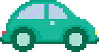

27.2. Анимације кретања домаћи
==============================

.. questionnote::

   Напиши програм који приказује анимацију авиона који се креће по
   небу и аутомобила који се креће по земљи, при чему је брзина авиона
   два пута већа него брзина аутомобила. Када неко возило изађе на десном
   крају екрана, појављује се поново на левом. Поново можеш употребити
   слике ``auto.png`` и ``avion.png``.

Стање сцене је одређено положајем аутомобила и авиона. Положај објеката биће одређен познавањем координата горњег левог угла ових слика (њих можемо чувати коришћењем променљивих auto_x, auto_y и avion_x, avion_Y). Поред тога, чуваћемо и саме слике аутомобила и авиона, као и променљиве којима су представљене њихове димензије.

Цртање вршимо веома једноставно, приказивањем ових слика на позицији одређеној тренутним координатама (auto_x, auto_y) и (avion_x, avion_y).

Померање објекта вршићемо само по оси ``x``. При преласку на сваки нови фрејм (у функцији novi_frejm) петље 
координатe auto_x и avion_x ћемо увећавати за одговарајући померај. За разлику од задатака у којима смо 
брзину кретања задавали бројем пиксела по фрејму, овај пут желимо да брзину задамо у броју пиксела у 
једној секунди. Да бисмо од брзине задате у пикселима по секунди добили број пиксела које аутомобил и 
авион треба да пређу по сваком фрејму, потребно је да израчунамо време dt које протекне између приказивања два узастопна фрејма. Њега лако израчунавамо на основу броја фрејмова у секунди (у питању је реципрочна вредност). Померај (пређени пут) онда израчунавамо као производ времена dt и брзине објеката изражене у броју пиксела у једној секунди.

Пошто желимо да се објекти стално померају по екрану, приликом преласка на сваки наредни фрејм, 
након померања објеката, потребно је проверити да ли су они излетели иза десне ивице екрана и, ако јесу, 
онда их треба пребацити на крајњи леви део екрана (иза леве ивице прозора). Сматраћемо да је објекат 
испао ван слике када му леви крај (одређен координатом ``x``) пређе ширину екрана (одређену променљивом sirina). Тада га враћамо тако да му десни крај буде на левој ивици екрана (леви крај му се тада налази у минусу и то тачно за ширину слике).

.. activecode:: auto_avion
   :nocodelens:
   :modaloutput: 
   :enablecopy:
   :playtask:
   :includexsrc: _includes/auto_avion.py

   avion_slika = pg.image.load("avion.png")
   (avion_x, avion_y) = (0, 0)
   avion_brzina = 200
   auto_slika = pg.image.load("auto.png")
   (auto_x, auto_y) = (0, visina - auto_slika.get_height())
   auto_brzina = 100
   FPS = 25
   dt = 1/FPS

   def crtaj():
      prozor.fill(pg.Color("white"))
      prozor.blit(avion_slika, (???, ???))
      prozor.blit(auto_slika, (???, ???))

   def novi_frejm():
       global ???

       # pomeramo auto
       auto_x += ???
       if auto_x > sirina:
          auto_x = - auto_slika.get_width()

       # pomeramo avion
       ???

       # crtamo scenu
       crtaj()

